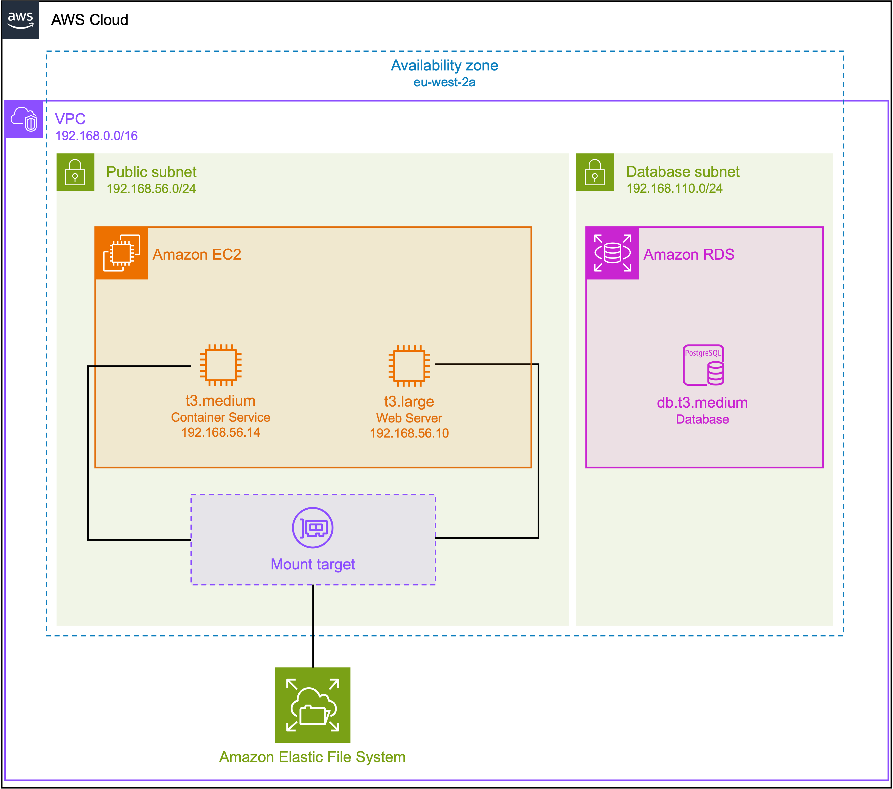

# xnat-aws

[](https://github.com/UCL-MIRSG/xnat-aws/actions/workflows/terraform.yaml)

Deploy XNAT on AWS using Terraform and Ansible.

Terraform is used to create the infrastructure on AWS and Ansible is then used to configure the instances for XNAT deployment.

Below is an overview of the infrastructure that will be created. See the notes on [provisioning the infrastructure](provision/README.md) for a more detailed description.

<p align="center" width="100%">
    
</p>

## Requirements

- An [AWS account](https://portal.aws.amazon.com/billing/signup?refid=em_127222&redirect_url=https%3A%2F%2Faws.amazon.com%2Fregistration-confirmation#/start/email)
- [AWS CLI v2](https://docs.aws.amazon.com/cli/latest/userguide/getting-started-install.html)
- AWS credentials stored locally using [`aws configure`](https://docs.aws.amazon.com/cli/latest/userguide/cli-configure-files.html#:~:text=settings%20using%20commands.-,aws%20configure,-Run%20this%20command) (or [`aws configure sso`](https://docs.aws.amazon.com/cli/latest/userguide/sso-configure-profile-token.html)) and then subsequently logging in using `aws sso login --profile <profile_name>`
- [Terraform](https://developer.hashicorp.com/terraform/tutorials/aws-get-started/install-cli) >= 0.15
- [Ansible](https://docs.ansible.com/ansible/latest/installation_guide/intro_installation.html#installing-and-upgrading-ansible) >= 2.15.0 - we recommend installing Ansible in a virtual environment, using either [Conda](https://docs.conda.io/en/latest/miniconda.html) or [Virtualenv](https://virtualenv.pypa.io/en/latest/)
- [Other Python dependencies](configure/README.md#install-python-dependencies) - these should be installed in the same virtual environment as Ansible. These dependencies are required if you would like to create a project and upload sample data to it.

## Quick start

Once you have installed and set up the requirements, there are three steps to deploying XNAT on AWS:

1. [Generate credentials](credentials/README.md). From the `xnat-aws/credentials` directory, type:

    ```bash
    terraform init
    terraform apply
    ```

    This will will create and SSH key and various passwords that will be used for accessing the AWS
    servers and configuring XNAT.

2. [Set the necessary Terraform variables](provision/README.md#usage). From the `xnat-aws/provision`
   directory:

    First copy the `terraform.tfvars.example` file to `terraform.tfvars`:

    ```bash
    cp terraform.tfvars.example terraform.tfvars
    ```

    Then edit the `terraform.tfvars` file to change any variables as necessary. In particular, you
    may want to change the [EC2 instance types](provision/README.md#instance-types).

3. [Create the AWS instances](provision/README.md#usage). From the `xnat-aws/provision` directory, type:

    ```bash
    terraform init
    terraform apply
    ```

    This will create the infrastructure on AWS.

    > **Note**: after the `terraform apply` steps have completed, you may need to wait 1-2 minutes
    > before running the configuration. This is to allow time for the AWS instances to finish starting up.

4. [Install XNAT](configure/README.md). From the `xnat-aws/configure` directory,  first type:

    ```bash
    python -m pip install -r requirements.txt
    ```

    This will install Ansible and other Python dependencies. Then, from the same directory, type:

    ```bash
    ./install_xnat.sh
    ```

    This will run several Ansible commands to install and configure XNAT.

    See [`Logging into the web server`](configure/README.md#logging-in-to-the-web-server) for notes on how to log into XNAT once it has been deployed.

5. \[Optional\] [Create a sample project and upload data](configure/README.md#create-a-sample-project-and-upload-data). From the `xnat-aws/configure` directory, type:

    ```bash
    ./setup_xnat_project.sh
    ```

    This will create a project on your XNAT server and upload data to it.

    The sample data can be used for running a [workshop](https://healthbioscienceideas.github.io/MedICSS-Project-Repro-Pipelines/) on implementing reproducible medical image analysis pipelines with XNAT.

## Important!

Don't forget to destroy your infrastructure when you're finished! Otherwise you may end up with a large AWS bill at the end of the month.

To destroy the infrastructure, go to the `xnat-aws/provision` directory and type:

```bash
terraform destroy
```

## AWS cost estimate

[It is estimated](provision/aws-cost-estimate.pdf) the AWS resources will cost approximately **$270
USD per month** (assuming the workshop is run for a whole month) or about **$68 USD per week**.

This is assuming usage of 50 hours per week (10 hours per day times 5 days per week) with the
following resources:

- web server: t3.large
- Container Service server: m4.xlarge
- database server: db.t3.medium
- up to 20 GB EFS storage
- AppStream instances for up to 10 users

The largest cost here are the AppStream instances, which cost about **$124 USD per month**. Without
using AppStream, the cost is reduced to about **$146 USD per month** or about **$37 USD per week**.

Note, it is recommended that you [set a monthly budget](https://aws.amazon.com/aws-cost-management/aws-budgets/) to avoid unexpected large bills.

## Testing

To test the infrastructure setup with multiple XNAT users, go to the `xnat-aws/configure` directory and type:

```bash
./run_tests.sh <number of users>
```

This will create the specified number of users on the XNAT server, each with their own project and
some example data. This can be useful to test whether the infrastructure can handle multiple users
running various tasks simultaneously.

See [`Testing with multiple users`](configure/README.md#testing-with-multiple-users) for more details.

## Acknowledgement

This work was funded by [Health and Bioscience IDEAS](https://healthbioscienceideas.github.io/), a project supported by the UKRI Innovation Scholars: Data Science Training in Health and Bioscience (MR/V03863X/1).
