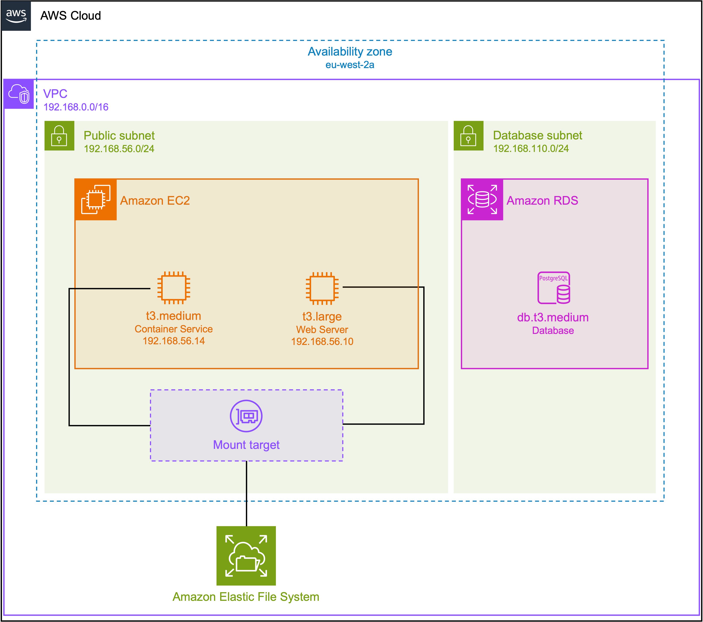

# Create infrastructure on AWS using Terraform

The Terraform scripts will create the following infrastructure on AWS:

<p align="center" width="100%">
    
</p>

- a Virtual Private Cloud (VPC), a public subnet, and two private subnets
- two EC2 instances - `xnat_web` and `xnat_cserv` for the web server and [XNAT Container Service](https://wiki.xnat.org/container-service/), respectively
- an RDS instance - `xnat_db` - for managing the PostgreSQL database
- an EFS instance used to store data uploaded to xnat; this volume is mounted on both the web server and Container Service server
- security groups to manage access to the servers

## Instance types

We have found that we need to use a `db.t3.medium` instance the database, a `m4.xlarge` instance for
the container service, and a `t3.large` instance for the web server, to prevent the site from
crashing when uploading data or running containers.

Note however that this is assuming only a single user is running analyses. If you have multiple
users, you may need to increase the instance type for the container service, as this
is where the plugin containers are run. In particular, the *FastSurfer* pipeline requires a lot of
memory and may fail if the instance type is too small.

You can change the instance type used by changing the `ec2_instance_types` variable in your `xnat-aws/provision/terraform.tfvars` file, e.g.:

```terraform
ec2_instance_types = {
  "xnat_web"   = "t3.large"
  "xnat_db"    = "db.t3.medium"
  "xnat_cserv" = "m4.xlarge"
}
```

Alternatively, you could use a [GPU-enabled instance](https://aws.amazon.com/ec2/instance-types/g4/)
for the container service and run the GPU version of the FastSurfer pipeline (see the
[`run_fastsurfer_gpu`](../configure/playbooks/roles/container_service_images/files/recon-all-gpu-command.json)
command). However, this will **significantly drive up the costs**.

You may also have to increase the amount of RAM reserved for Java (and thus XNAT) in the Ansible configuration. In the file `xnat-aws/configure/group_vars/xnat.yml` you would need to modify the `java.mem` variable, e.g.:

```yaml
java_mem:
  Xms: "512M"
  Xmx: "16G"
  MetaspaceSize: "300M"
```

<details><summary>Notes on the infrastructure that is created</summary>

### Subnets and availability zones

We create a public and private subnet in a single availability zone, and this is where all resources are deployed. However, we also create a second private subnet in a second availability zone, but nothing is deployed here.

This is due a [requirement of RDS to have subnets defined in at least two availability zones, even if you're deploying in a single availability zone](https://repost.aws/questions/QUf7DbNMKFQmWiRg8oMB0obA/why-must-an-rds-always-have-two-subnets#ANurWZpEHBRPa1SwrtRh9Q9w). but deploy instance in only two subnets in a single availability zone.

### Security groups and access

We create a security group for each instance - the web server, database, and container service.

#### Web server security group

The web server security group allows SSH, HTTP, and HTTPS access from the IP address from which Terraform was run (i.e. your own IP address). Access is restricted for security reasons.

SSH access is required to configure the server using Ansible.

#### Database security group

The database security group only allows access to port 5432 (for connecting to the database). Access is limited to the web server only - all other connections will be refused.

#### Container Service security group

The Container Service security group allows SSH access from the IP address from which Terraform was ran. It also allows access to port 2376 (for the Container Service) from the web server only.

SSH access is required to configure the server using Ansible.

#### Extending access to other IP addresses

HTTP access to the web server can be extended to other IP addresses through the `extend_http_cidr`
variable. For example, to allow access from all IP addresses, in the file `xnat-aws/provision/terraform.tfvar`:

```
extend_http_cidr = [
  "0.0.0.0/0",
]
```

Similarly, SSH access to the web server and Container Service server can be extended to other IP addresses through the `extend_SSH` variable:

```
extend_ssh_cidr = [
  "0.0.0.0/0",
]
```

However, extending access to all IP addresses is not recommended.

</details>

## Usage

First set the necessary variables. Copy the file `xnat-aws/provision/terraform.tfvars_sample` to
`xnat-aws/provision/terraform.tfvars`. You shouldn't need to change any values but may do so if you
wish to e.g. use a `t3.large` EC2 instance for the web server.

```sh
cd provision
cp terraform.tfvars_sample terraform.tfvars
```

Then, to create the infrastructure on AWS run the following commands from within the `xnat-aws/provision` directory:

```bash
terraform init
teraform apply
```

## Output

After running `terraform apply`, the following outputs will be printed:

- `ansible_install_xnat`: the command to run to configure the infrastructure with Ansible
- `xnat_web_url`: the URL of the web server for logging into XNAT

See [`xnat-aws/configure/README.md`](../configure/README.md#deploy-xnat) for notes on running the XNAT installation.

## Destroy the infrastructure

To destroy the infrastructure, type:

```bash
terraform destroy
```

## AppStream

As part of the setup, we provide an [AppStream 2.0](https://aws.amazon.com/appstream2/) instance to
access the files stored on the EFS volume. This allows exploring the files used and generaged by
XNAT and run external software on the data. By default, the [AppStream image](https://github.com/HealthBioscienceIDEAS/terraform-aws-IDEAS-appstream) has
[**FSL**](https://fsl.fmrib.ox.ac.uk/fsl/fslwiki/) installed.

The AppStream image is only created if the `create_appstream` variable is set to `true`. When
running `terraform apply`, the user will be prompted to enter a value for this variable.
Alternatively, you can use

```bash
terraform apply -var 'create_appstream=true'
```

to skip the prompt.

<!-- BEGIN_TF_DOCS -->
## Requirements

| Name | Version |
|------|---------|
| <a name="requirement_terraform"></a> [terraform](#requirement\_terraform) | >=0.15 |
| <a name="requirement_terraform"></a> [terraform](#requirement\_terraform) | >= 1.1.4 |
| <a name="requirement_aws"></a> [aws](#requirement\_aws) | >= 5.30.0 |

## Providers

| Name | Version |
|------|---------|
| <a name="provider_aws"></a> [aws](#provider\_aws) | 5.52.0 |
| <a name="provider_local"></a> [local](#provider\_local) | 2.5.1 |

## Modules

| Name | Source | Version |
|------|--------|---------|
| <a name="module_appstream"></a> [appstream](#module\_appstream) | github.com/HealthBioscienceIDEAS/terraform-aws-IDEAS-appstream | n/a |
| <a name="module_database"></a> [database](#module\_database) | ./modules/database | n/a |
| <a name="module_efs"></a> [efs](#module\_efs) | ./modules/efs | n/a |
| <a name="module_get_ami"></a> [get\_ami](#module\_get\_ami) | ./modules/get_ami | n/a |
| <a name="module_get_my_ip"></a> [get\_my\_ip](#module\_get\_my\_ip) | ./modules/get_my_ip | n/a |
| <a name="module_setup_vpc"></a> [setup\_vpc](#module\_setup\_vpc) | terraform-aws-modules/vpc/aws | n/a |
| <a name="module_web_server"></a> [web\_server](#module\_web\_server) | ./modules/web-server | n/a |

## Resources

| Name | Type |
|------|------|
| [aws_key_pair.key_pair](https://registry.terraform.io/providers/hashicorp/aws/latest/docs/resources/key_pair) | resource |
| [aws_security_group_rule.appstream_allow_all_outgoing](https://registry.terraform.io/providers/hashicorp/aws/latest/docs/resources/security_group_rule) | resource |
| [local_file.ansible-hosts](https://registry.terraform.io/providers/hashicorp/local/latest/docs/resources/file) | resource |

## Inputs

| Name | Description | Type | Default | Required |
|------|-------------|------|---------|:--------:|
| <a name="input_as2_desired_instance_num"></a> [as2\_desired\_instance\_num](#input\_as2\_desired\_instance\_num) | Number of instances to use for the AppStream image | `number` | `1` | no |
| <a name="input_as2_image_name"></a> [as2\_image\_name](#input\_as2\_image\_name) | Name of the AppStream image | `string` | `"IDEAS-FSL-AmazonLinux2-EFSMount-2023-08-30"` | no |
| <a name="input_as2_instance_type"></a> [as2\_instance\_type](#input\_as2\_instance\_type) | Instance type to use for the AppStream image | `string` | `"stream.standard.medium"` | no |
| <a name="input_availability_zones"></a> [availability\_zones](#input\_availability\_zones) | AZs to use for deploying XNAT | `list(string)` | <pre>[<br>  "eu-west-2a",<br>  "eu-west-2b"<br>]</pre> | no |
| <a name="input_aws_region"></a> [aws\_region](#input\_aws\_region) | AWS region to use for deploying XNAT | `string` | `"eu-west-2"` | no |
| <a name="input_create_appstream"></a> [create\_appstream](#input\_create\_appstream) | Whether to create an AppStream image | `bool` | n/a | yes |
| <a name="input_ec2_instance_types"></a> [ec2\_instance\_types](#input\_ec2\_instance\_types) | Instance type to use for each server | `map(any)` | <pre>{<br>  "xnat_cserv": "m4.xlarge",<br>  "xnat_db": "db.t3.large",<br>  "xnat_web": "t3.large"<br>}</pre> | no |
| <a name="input_extend_http_cidr"></a> [extend\_http\_cidr](#input\_extend\_http\_cidr) | The CIDR blocks to grant HTTP access to the web server, in addition to your own IP address | `list(string)` | `[]` | no |
| <a name="input_extend_https_cidr"></a> [extend\_https\_cidr](#input\_extend\_https\_cidr) | The CIDR blocks to grant HTTSP access to the web server, in addition to your own IP address | `list(string)` | `[]` | no |
| <a name="input_extend_ssh_cidr"></a> [extend\_ssh\_cidr](#input\_extend\_ssh\_cidr) | CIDR blocks servers should permit SHH access from, in addition to your own IP address | `list(string)` | `[]` | no |
| <a name="input_instance_os"></a> [instance\_os](#input\_instance\_os) | OS to use for the instance - will determine the AMI to use | `string` | `"rocky9"` | no |
| <a name="input_instance_private_ips"></a> [instance\_private\_ips](#input\_instance\_private\_ips) | Private IP addresses for each instance | `map(any)` | <pre>{<br>  "xnat_cserv": "192.168.56.14",<br>  "xnat_web": "192.168.56.10"<br>}</pre> | no |
| <a name="input_root_block_device_size"></a> [root\_block\_device\_size](#input\_root\_block\_device\_size) | Storage space on the root block device (GB) | `number` | `30` | no |
| <a name="input_smtp_private_ip"></a> [smtp\_private\_ip](#input\_smtp\_private\_ip) | Private IP address to use to the SMTP mail server | `string` | `"192.168.56.101"` | no |
| <a name="input_subnet_cidr_blocks"></a> [subnet\_cidr\_blocks](#input\_subnet\_cidr\_blocks) | CIDR block for the VPC and subnets | `map(any)` | <pre>{<br>  "private": [<br>    "192.168.100.0/24",<br>    "192.168.101.0/24"<br>  ],<br>  "public": [<br>    "192.168.56.0/24"<br>  ]<br>}</pre> | no |
| <a name="input_vpc_cidr_block"></a> [vpc\_cidr\_block](#input\_vpc\_cidr\_block) | CIDR block for the VPC | `string` | `"192.168.0.0/16"` | no |

## Outputs

| Name | Description |
|------|-------------|
| <a name="output_ansible_install_xnat"></a> [ansible\_install\_xnat](#output\_ansible\_install\_xnat) | Run this command from the `xnat-aws/configure` directory to install and configure XNAT. |
| <a name="output_xnat_web_url"></a> [xnat\_web\_url](#output\_xnat\_web\_url) | Once XNAT has been installed and configured, the web server will be accessible at this URL. |
<!-- END_TF_DOCS -->
